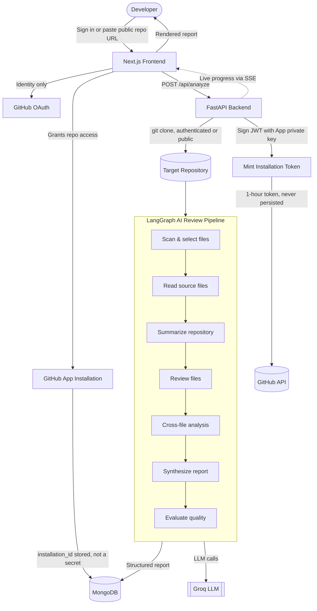
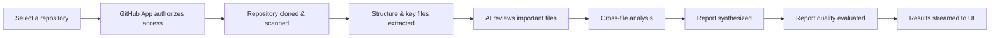
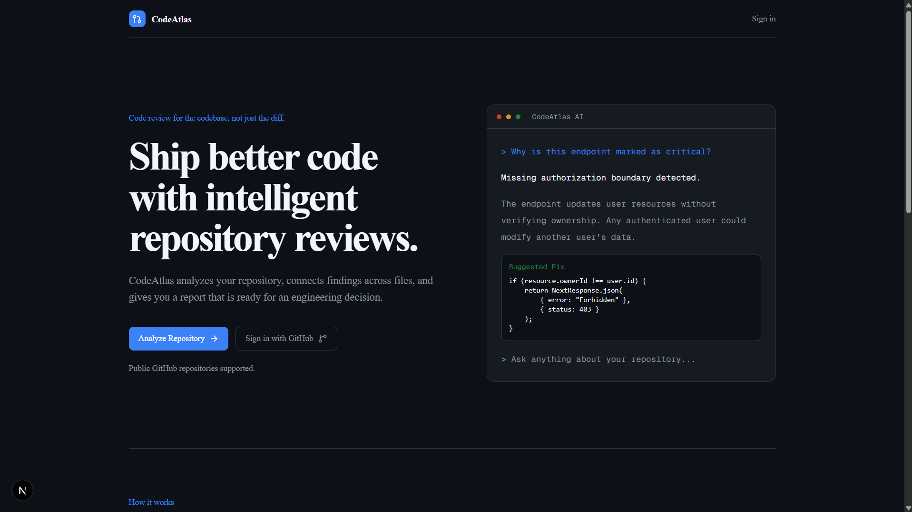
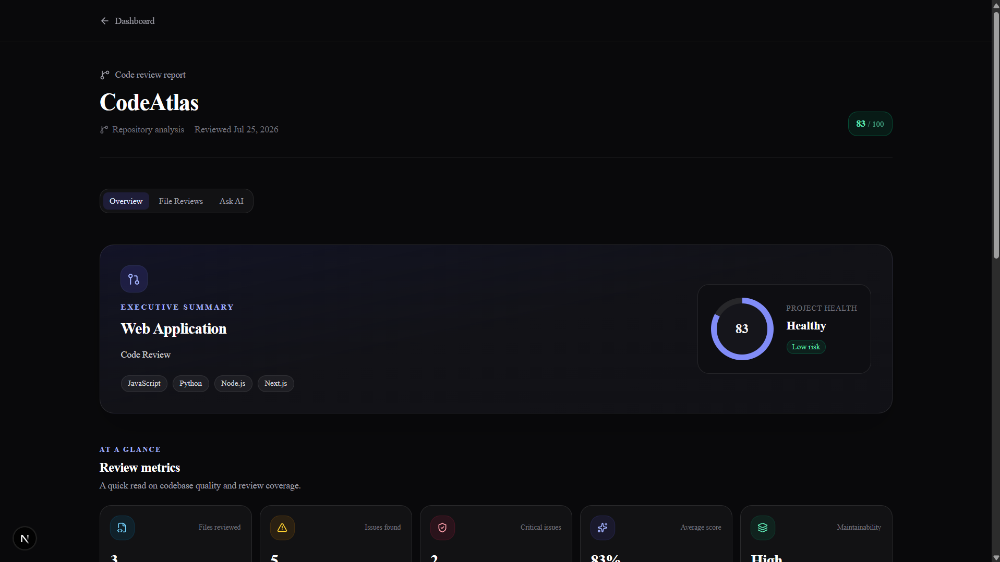
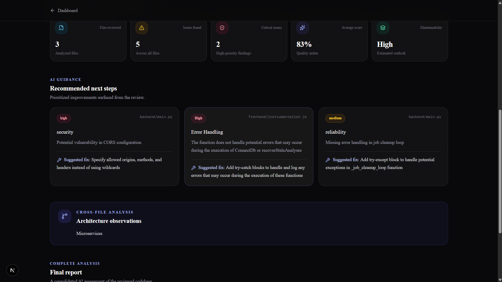
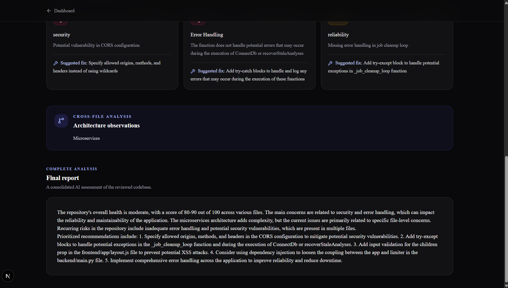
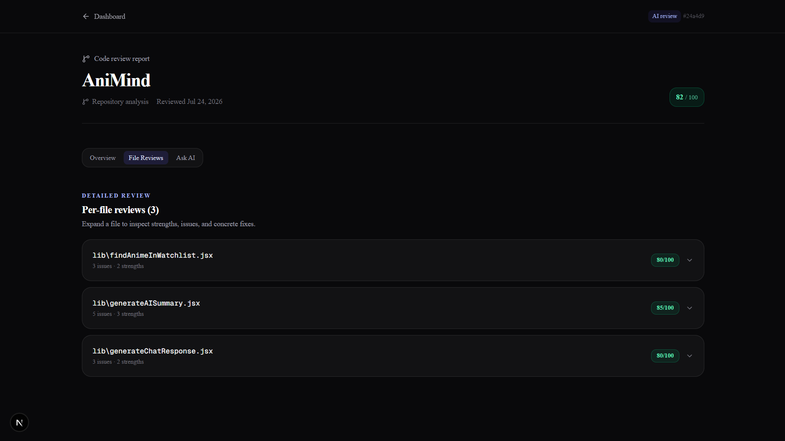
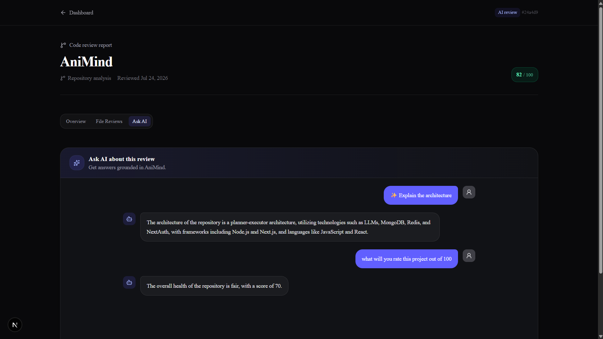

#  CodeAtlas

**AI-powered repository intelligence that helps developers understand, review, and navigate any GitHub codebase.**

[](#)
[](#)
[](#)
[](#-license)

---

## ✨ Overview

CodeAtlas is an AI-driven static analysis and code review platform for GitHub repositories.
 
Given a repository URL, it clones the codebase, selects a prioritized subset of source files based on directory structure, filename signals, and file size, and runs them through a multi-stage LangGraph pipeline: repository summarization, per-file review, cross-file dependency analysis, report synthesis, and an evaluation pass on the generated report itself. The output is a structured report rather than inline comments:
 
- 🏗️ **Architecture summary** — how the repository's modules and directories relate to each other
- 🧩 **Cross-file analysis** — dependencies and risk that propagate across file boundaries, not just within a single file
- 🐞 **Findings** — security, reliability, and maintainability issues, each backed by evidence from the source
- 💡 **Recommendations** — concrete, actionable fixes tied to specific findings
- 📋 **Executive summary** — a condensed view of the repository and its most important issues
Public repositories can be analyzed without authentication, since no repository access token is required to clone them. Private repositories require installing the CodeAtlas GitHub App, which scopes access to explicitly authorized repositories only. After analysis completes, a chat interface backed by the same pipeline context is available for follow-up queries about the repository.

---

## 🚀 Features

### 📂 Repository Analysis
- Analyze any **public repository instantly** — no sign-in required
- Analyze **private repositories** by installing the CodeAtlas GitHub App
- Automatic repository scanning and directory-tree generation
- Smart file selection that prioritizes the code most worth reviewing, so analysis stays fast and focused

### 🤖 AI Code Review
- File-level review with concrete findings
- Cross-file reasoning — traces how a risk in one file propagates through the codebase
- Repository-wide architectural summary
- Best-practice and code-quality suggestions
- 💬 Built-in chat to ask questions about the codebase after the review completes

### ⚡ Live Progress
Watch the analysis happen in real time, streamed to the browser via **Server-Sent Events**:

```
Cloning repository...
Scanning repository...
Reviewing source files...
Analyzing cross-file relationships...
Synthesizing report...
Evaluating report quality...
Completed ✅
```

### 🔒 Secure Access by Design
CodeAtlas never stores a long-lived GitHub token.

- **GitHub OAuth** — used only to identify who's signed in, nothing more
- **GitHub App installation** — the only thing that grants repository access, scoped to exactly the repos you choose
- **Short-lived installation tokens** — minted on demand, valid for ~1 hour, never persisted to the database
- Public repos are analyzed without any credentials at all

### 📊 The Report
Every analysis produces:
- Executive Summary
- Important Files identified
- Per-file Reviews with evidence
- Repository-wide Insights
- Actionable Recommendations
- A final, evaluated AI Report

---

## 🏗 Architecture



**Why this shape matters:** the frontend and backend each mint their own installation tokens independently — neither one ever hands a raw credential to the other, and nothing sensitive ever reaches the browser.

---

## 🛠 Tech Stack

| Layer | Stack |
|---|---|
| **Frontend** | Next.js, React, Tailwind CSS, NextAuth.js |
| **Backend** | FastAPI, Python, LangGraph, LangChain |
| **Database** | MongoDB Atlas |
| **AI** | Groq (LangChain-compatible) |
| **Auth** | GitHub OAuth (identity) + GitHub App (access) |
| **Deployment** | Vercel (frontend) · Render (backend) |

---

## ⚙️ Workflow



---

## 📸 Screenshots

### Landing Page

Analyze any GitHub repository with AI-powered code reviews.



---

### Analysis Report

Executive summary with health score and AI insights.



Detailed repository metrics and recommendations.



Cross-file architecture analysis.



Individual file review.



AI Chat assistant.



---

## 🔑 Environment Variables

**Frontend** (`frontend/.env.local`)
```env
NEXTAUTH_URL=
NEXTAUTH_SECRET=

MONGODB_URI=

# GitHub OAuth — identity only, no repo access
GITHUB_ID=
GITHUB_SECRET=


GITHUB_APP_ID=
GITHUB_APP_PRIVATE_KEY=
NEXT_PUBLIC_GITHUB_APP_SLUG=

INTERNAL_API_TOKEN=
NEXT_PUBLIC_FASTAPI_URL=
```

**Backend** (`backend/.env`)
```env
GROQ_API_KEY=
GROQ_MODEL=

INTERNAL_API_TOKEN=

GITHUB_APP_ID=
GITHUB_APP_PRIVATE_KEY=
```

> `INTERNAL_API_TOKEN` must match on both sides — it authenticates requests between the frontend and backend. `GITHUB_APP_PRIVATE_KEY` is the same PEM on both sides too; each service mints its own tokens independently.

---

## 🚀 Local Setup

**Clone**
```bash
git clone https://github.com/yourusername/CodeAtlas.git
cd CodeAtlas
```

**Frontend**
```bash
cd frontend
npm install
npm run dev
```

**Backend**
```bash
cd backend
pip install -r requirements.txt
uvicorn main:app --reload
```

Open [http://localhost:3000](http://localhost:3000).

> Before running locally, create a GitHub App (Settings → Developer settings → GitHub Apps) with Contents: Read-only and Metadata: Read-only permissions, and set its **Setup URL** to `<your-frontend-url>/api/github/install/callback` so installations actually reach your app.

---

## 🤝 Contributing

Contributions are welcome! Fork the repository, make your changes, and submit a pull request.

## 📄 License

MIT License

## 👨‍💻 Author

**Sanchit Ghumare**
